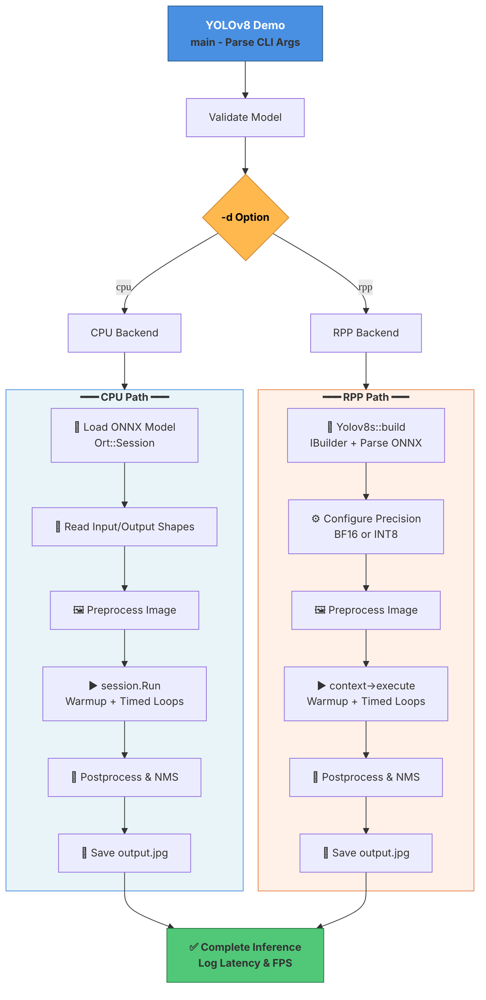

# 🚀 YOLOv8 Inference Demo (RPP + ONNXRuntime)


**A flexible dual-backend C++ YOLOv8 detection framework** supporting both GPU (RPP/OpenRT) and CPU (ONNXRuntime) with dynamic model dimensions and adaptive output shape handling.

---

## 📋 Table of Contents

- [Overview](#overview)
- [Key Features](#key-features)
- [Code Structure](#code-structure)
- [Execution Flow Diagram](#execution-flow-diagram)
- [System Architecture](#system-architecture)
- [Build & Run](#build--run)
- [Model Export](#model-export)
- [Implementation Details](#implementation-details)

---

## Overview

This project delivers a production-ready YOLOv8 object detection framework designed for high-performance inference across diverse hardware platforms. The implementation supports flexible model architectures with dynamic input/output tensor shapes, making it compatible with any YOLOv8 variant (nano, small, medium, large, xlarge).

| | RPP (GPU) | CPU (ONNXRuntime) |
|---|---|---|
| **Backend** | RPP/OpenRT | ONNX Runtime |
| **Performance** | High (GPU accelerated) | Portable (CPU-based) |
| **Use Case** | Production inference | Development/Edge |
| **Precision** | FP32, BF16, INT8 | FP32, FP16 |

---

## Key Features

- ✅ **Dual Inference Backends**: Seamless GPU (RPP) and CPU (ONNXRuntime) support
- ✅ **Dynamic Model Sizes**: From 640×640 to 1920×1080+ (or custom dimensions)
- ✅ **Precision Flexibility**: Supports FP32, BF16, INT8 quantization modes
- ✅ **Automatic Detection**: Precision inferred from model filename convention
- ✅ **Bidirectional Pipelines**: CSV/preprocess → inference → NMS → visualization
- ✅ **Performance Metrics**: Real-time FPS & latency logging per run
- ✅ **Production-Ready**: Full CMake integration, error handling, logging

---

## 📁 Code Structure

```
YOLOv8/
│
├── yolo/                              # Core inference implementation
│   ├── yolo_main.cpp                  # CLI entry + CPU ONNXRuntime path
│   ├── yolov8.cpp                     # RPP/GPU build/infer/postprocess
│   └── yolov8.h                       # Yolov8s class interface
│
├── common/                            # Shared utilities
│   ├── infer/
│   │   ├── infer_sample_base.h/cpp    # Base SampleModel class
│   │   └── ...
│   ├── calibrator/                    # INT8 quantization tools
│   ├── logger.h/cpp                   # Logging framework
│   └── rpp_buffer_manager.h           # GPU memory management
│
├── export.py                          # YOLOv8 → ONNX export script
├── requirements.txt                   # Python dependencies
├── CMakeLists.txt                     # Build configuration
└── README.md                          # This file
```

---

## 🔄 Execution Flow Diagram



---

## System Architecture

### Runtime Context

**RPP Path (`-d rpp`)**
- Inference Stack: `infer1::IBuilder` + `INetworkDefinition` + `IBuilderConfig` + `IExecutionContext`
- ONNX Parsing: `onnxparser::createParser()` → `onnx_parser()`
- Execution: `context->execute()` with `samplesCommon::RppBufferManager` buffer management
- Input: Dynamic dims from model (e.g., 640×640, 1280×1280, 1920×1080)
- Output: Runtime shapes supporting variable anchor counts (8400, 34000, etc.)

**CPU Path (`-d cpu`)**
- Inference Stack: `Ort::Session` + `Ort::Value::CreateTensor` + `session.Run()`
- Model Loading: Direct ONNX file to session
- Input: Auto-detected or fallback 640×640
- Output: Dynamic shape from ONNXRuntime tensor metadata

**Common Pipeline**
- Image I/O: `cv::imread` (input) → `cv::imwrite` (output)
- Visualization: `cv::rectangle` (boxes) + `cv::putText` (labels)

### Detailed Code Workflow

#### 1️⃣ Build Phase (RPP only)
1. Initialize `infer1::IBuilder` for engine construction
2. Parse ONNX model via `onnxparser::IParser` into `INetworkDefinition`
3. Configure precision (BF16/INT8) based on model filename pattern
4. Set workspace, batch size, and optimization flags
5. Build optimized engine via `builder->buildEngineWithConfig()`
6. Cache input/output tensor names and dimensions for later use

#### 2️⃣ Preprocess Phase
1. Load image: `cv::imread(path, cv::IMREAD_COLOR)`
2. **Letterbox Transform**:
   - Calculate aspect-ratio-preserving resize ratio
   - Resize image maintaining proportions
   - Pad to model input size (zero-fill)
3. **Normalization**:
   - BGR → RGB color space conversion
   - Pixel values [0,255] → [0,1] float normalization
4. **Layout Conversion**:
   - Split into R/G/B channels
   - Merge to NCHW (batch, channels, height, width) layout
   - Copy to input buffer for inference

#### 3️⃣ Inference Phase
1. Create execution context or session from pre-built engine
2. **Data Transfer**:
   - Host-to-device memory copy (RPP) or tensor creation (CPU)
   - Warmup inference pass to stabilize latency
3. **Timed Loop** (configurable repetitions):
   - Execute inference: `context->execute()` or `session.Run()`
   - Record latency per iteration
   - Device-to-host memory copy
4. **Metrics**: Compute average latency and FPS

#### 4️⃣ Postprocess Phase
1. Extract output tensor from buffers (shape: e.g., [1, 84, 8400])
2. **Candidate Decoding**:
   - Transpose to candidate-major ordering
   - For each anchor: extract (cx, cy, w, h) + confidence scores
   - Find max confidence class index
3. **Filtering**:
   - Score threshold: keep confidence > 0.25
   - Sort by confidence descending
4. **NMS** (Non-Maximum Suppression):
   - Class-wise IoU computation (threshold 0.45)
   - Remove overlapping boxes
5. **Visualization**:
   - Scale coordinates back to original image resolution
   - Draw boxes: `cv::rectangle()` with color
   - Add labels: `cv::putText()` with confidence %
6. **Output**: Save annotated image to disk

#### 5️⃣ Teardown Phase
1. Release execution context
2. Deallocate GPU memory (RPP)
3. Auto-cleanup via smart pointers

---

## Build & Run

### Prerequisites
```bash
# System dependencies (Debian/Ubuntu)
sudo apt-get install -y cmake build-essential libopencv-dev

# Python export tools (optional)
pip install -r requirements.txt
```

### Build
```bash
mkdir -p build && cd build
cmake ..
make -j$(nproc)
```

### Run Inference

**GPU Inference (RPP)**
```bash
./YOLOv8_demo \
  -o ../models/yolov8m.onnx \
  -i ../doc/images/5461697264_b231724778_b.jpg \
  -d rpp \
  -l 1
```

**CPU Inference (ONNXRuntime)**
```bash
./YOLOv8_demo \
  -o ../models/yolov8m.onnx \
  -i ../doc/images/5461697264_b231724778_b.jpg \
  -d cpu \
  -l 1
```

### CLI Options
```
Usage: YOLOv8_demo [options]

Options:
  -o, --onnx PATH       ONNX model file path (default: yolov8m.onnx)
  -i, --image PATH      Input image file path (auto-detected if omitted)
  -d, --device TYPE     Inference device: 'rpp' or 'cpu' (default: rpp)
  -l, --loop COUNT      Number of inference iterations for benchmarking (default: 1)
  -v, --verbose         Enable verbose logging (default: off)
  -h, --help            Show this help message
```

---

## Model Export

### Export YOLOv8 to ONNX

**Install dependencies:**
```bash
pip install -r requirements.txt
```

**Export model:**
```bash
python3 export.py \
  --weights yolov8m.pt \
  --imgsz 640 640 \
  --opset 12 \
  --simplify \
  --output-dir models
```

**Export options:**
| Option | Type | Default | Description |
|--------|------|---------|-------------|
| `--weights` | str | yolov8m.pt | Ultralytics pretrained weights |
| `--imgsz` | int+ | 640 | Input size (single or H W) |
| `--opset` | int | 12 | ONNX opset version |
| `--batch` | int | 1 | Batch size for export |
| `--device` | str | cpu | Export device (cpu/0/1/...) |
| `--half` | flag |  | Export FP16 if supported |
| `--dynamic` | flag |  | Enable dynamic input shapes |
| `--simplify` | flag |  | Run ONNX simplification |
| `--output-dir` | str | models | Output directory |

---

## Implementation Details

### High-Level Workflow

```
CLI Arguments → Validation → [CPU Path / RPP Path] → Output Image + Metrics
```

1. **Parse** CLI options: model, image, device, loop count
2. **Validate** file existence and infer precision from filename
3. **Branch**:
   - **CPU**: Load session → preprocess → inference → postprocess
   - **RPP**: Build engine → preprocess → inference → postprocess
4. **Save** annotated output: `output_cpu.jpg` or `output_N.jpg`
5. **Report** latency, FPS, detection count

### Precision Detection

Model filename convention:
- Contains `int8` or `quant` → INT8 mode
- Otherwise → BF16 (RPP) or FP32 (CPU)

Example:
```
yolov8m.onnx          → BF16 / FP32
yolov8m.int8.onnx     → INT8
yolov8m.quant.onnx    → INT8
```

---

## Example Output

**Terminal Log:**
```
Detected precision: int8
Building and running RPP inference.
Building engine from ONNX model...
Running preprocess...
input image file path: ../doc/images/5461697264_b231724778_b.jpg
Running inference...
inference takes: 45.2 milliseconds, frames per second: 22
output image: output_0.jpg
```

**Result Image:**
Annotated output with bounding boxes and confidence scores saved to `output_0.jpg`.

---

## Performance Benchmarks

*Example results on reference hardware*

| Model | Backend | Precision | Input | Latency | FPS |
|-------|---------|-----------|-------|---------|-----|
| YOLOv8n | RPP | BF16 | 640×640 | 12.5 ms | 80 |
| YOLOv8m | RPP | BF16 | 640×640 | 45.2 ms | 22 |
| YOLOv8m | CPU | FP32 | 640×640 | 180.0 ms | 5.6 |
| YOLOv8m.int8 | RPP | INT8 | 640×640 | 28.1 ms | 35 |

---

## Troubleshooting

| Issue | Solution |
|-------|----------|
| Model not found | Verify path with `-o` flag; use absolute paths for reliability |
| Image not found | Provide valid image path with `-i`; supports jpg/png formats |
| Precision not detected | Use naming convention: `model.int8.onnx` or `model.onnx` |
| ONNX parsing errors | Verify ONNX opset ≥ 12; simplify before export |
| Memory errors (RPP) | Reduce batch size or input resolution |

---

## License & Attribution

- **YOLOv8**: Ultralytics (GPL 3.0)
- **ONNX Runtime**: Microsoft (MIT)
- **OpenCV**: OpenCV team (Apache 2.0)
- **RPP/OpenRT**: Internal framework

---

