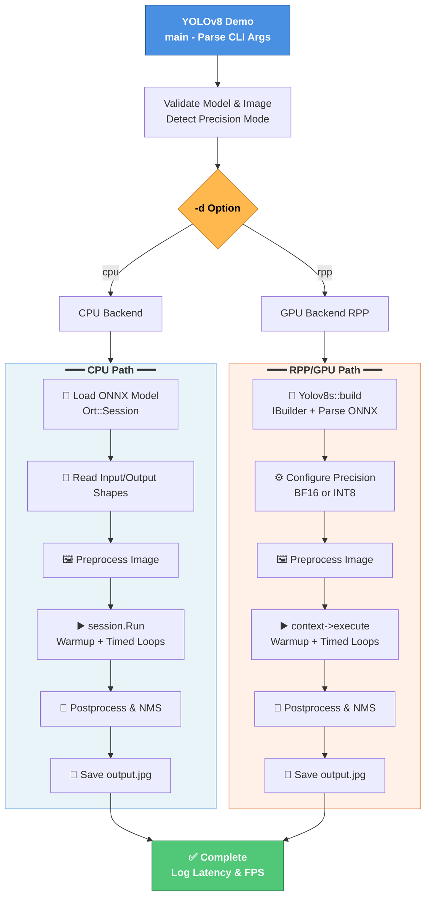

# YOLOv8 Demo (RPP + CPU ONNXRuntime)


A flexible C++ YOLOv8 detection demo for GPU (RPP/OpenRT) and CPU (ONNXRuntime) with dynamic model size support and runtime output shape handling.

## Runtime Context

- **RPP path (`-d rpp`)**
  - Uses RPP/OpenRT inference stack (`infer1::IBuilder`, `INetworkDefinition`, `IBuilderConfig`, `IExecutionContext`).
  - Parses ONNX via `onnxparser::createParser(...)` and `onnx_parser(...)`.
  - Executes model with `context->execute(...)`, manages buffers with `samplesCommon::RppBufferManager`.
  - Input dims are read from model tensor shape and support non-640x640 sizes (e.g., 1280x1280, 1920x1080).
  - Output dims are read at runtime, supporting different anchor counts (`8400`, `34000`, etc.).

- **CPU path (`-d cpu`)**
  - Uses ONNXRuntime C++ API (`Ort::Session`, `Ort::Value::CreateTensor`, `session.Run(...)`).
  - Input dims read from ONNX model shape, with 640x640 fallback for dynamic inputs.
  - Output dims read at runtime from ONNXRuntime tensor shape.

- **Image and visualization**
  - Input decode: `cv::imread`.
  - Draw boxes and labels: `cv::rectangle`, `cv::putText`.
  - Output save: `cv::imwrite`.

## Detailed Code Workflow

### Build Phase
The build phase converts the ONNX model into an optimized runtime engine:
1. Creates an `infer1::IBuilder` instance for engine construction (see `yolo/yolov8.cpp`).
2. Parses the ONNX model using `onnxparser::IParser` to populate the `INetworkDefinition`.
3. Configures builder settings like max batch size, workspace size, and precision (BF16 or INT8 based on model filename).
4. Builds the engine with `builder->buildEngineWithConfig(...)`.
5. Extracts input/output binding names and dimensions for later use.

### Preprocess Phase
Preprocess prepares the input image for model inference:
1. Loads the image using OpenCV's `cv::imread` (in `yolo/yolov8.cpp::PreProcess()`).
2. Computes aspect-ratio preserving resize ratio to fit within model input size.
3. Resizes the image while maintaining aspect ratio.
4. Creates a padded canvas and copies the resized image to it.
5. Converts BGR image to RGB color space.
6. Normalizes pixel values from [0,255] to [0,1].
7. Splits into separate color channels and rearranges to NCHW (batch, channel, height, width) tensor layout.
8. Copies the tensor data to the input buffer for GPU inference.

### Inference Phase
The inference phase executes the model on the preprocessed input:
1. Creates an `IExecutionContext` from the built engine.
2. Copies input buffers from host to device memory.
3. Performs a warmup inference to stabilize timing measurements.
4. Runs timed inference loops (configurable via `--loop` parameter).
5. Executes `context->execute(...)` to run the neural network (RPP path in `yolo/yolov8.cpp::infer()`).
6. Executes `session.Run(...)` for CPU path inference (in `yolo/yolo_main.cpp`).
7. Copies output buffers from device back to host memory.
8. Measures and reports inference latency and FPS.

### Postprocess Phase
Postprocess decodes model outputs and generates visualizations:
1. Extracts raw output tensor from buffers (shape determined at runtime).
2. Transposes output to candidate-major view for easier processing (see `yolo/yolov8.cpp::NMS()`).
3. For each detection candidate:
   - Extracts center coordinates (cx, cy), width/height (ow, oh).
   - Finds the class with highest confidence score.
   - Filters candidates with confidence > 0.25.
4. Scales bounding box coordinates back to original image dimensions.
5. Applies Non-Maximum Suppression (NMS) with IoU threshold of 0.45 to remove overlapping detections.
6. Draws bounding boxes and confidence labels on the original image using OpenCV (in `yolo/yolov8.cpp::Draw()`).
7. Saves the annotated image to disk.

### Teardown Phase
Cleans up resources after inference completion:
1. Destroys execution context and stream objects.
2. Releases buffer memory managed by `RppBufferManager`.
3. Engine and builder resources are automatically cleaned up via smart pointers.

## Code Structure

```
yolo/
  yolo_main.cpp       - CLI entry point and CPU ONNXRuntime inference path
  yolov8.cpp          - RPP/GPU inference, preprocess, postprocess, NMS, draw
  yolov8.h            - Yolov8s class definition

common/
  infer/              - Base class for model build/infer flow (SampleModel)
  calibrator/         - Calibration utilities for quantized models
  logger.h/cpp        - Logging utilities
  rpp_buffer_manager.h - GPU buffer management

export.py             - Python script to export YOLOv8 models from Ultralytics to ONNX
requirements.txt      - Python dependencies for export tool
```

## High-Level Workflow

1. Parse CLI options in `main` (`--onnx`, `--image`, `--device`, `--loop`).
2. Validate model/image files and infer precision mode from model filename.
3. Run one of two execution paths:
   - **RPP path**: build engine -> preprocess -> warmup -> timed inference -> postprocess/draw.
   - **CPU path**: prepare ONNXRuntime input tensor -> warmup -> timed inference -> postprocess/draw.
4. Save output image:
   - RPP path: `output_0.jpg`, `output_1.jpg`, ...
   - CPU path: `output_cpu.jpg`.

## Execution Flow Diagram



## Build and Run

From project root:

```bash
mkdir -p build
cd build
cmake ..
make -j
```

RPP inference:

```bash
./YOLOv8_demo -o ../models/yolov8m.onnx -i ../doc/images/5461697264_b231724778_b.jpg -d rpp
```

CPU inference:

```bash
./YOLOv8_demo -o ../models/yolov8m.onnx -i ../doc/images/5461697264_b231724778_b.jpg -d cpu
```

## Exporting ONNX models

This repository includes `export.py` for exporting Ultralytics YOLOv8 weights to ONNX.

1. Install Python dependencies:

```bash
pip install -r requirements.txt
```

2. Export a model (example):

```bash
python3 export.py --weights yolov8m.pt --imgsz 640 640 --opset 12 --batch 1  --simplify --output-dir models
```

3. Use the exported ONNX directly with the demo:

```bash
./YOLOv8_demo -o ../models/yolov8m.onnx -i ../doc/images/5461697264_b231724778_b.jpg
```

### export.py options

- `--weights`: local or remote YOLOv8 weights (e.g. `yolov8n.pt`, `yolov8m.pt`)
- `--imgsz`: single value (square) or two values (`height width`)
- `--opset`: ONNX opset version (default 12)
- `--batch`: batch size
- `--device`: export device (`cpu`, `0`, etc.)
- `--half`: export FP16 if supported
- `--dynamic`: enable dynamic input shape
- `--simplify`: run simplification
- `--output-dir`: directory to save ONNX model
